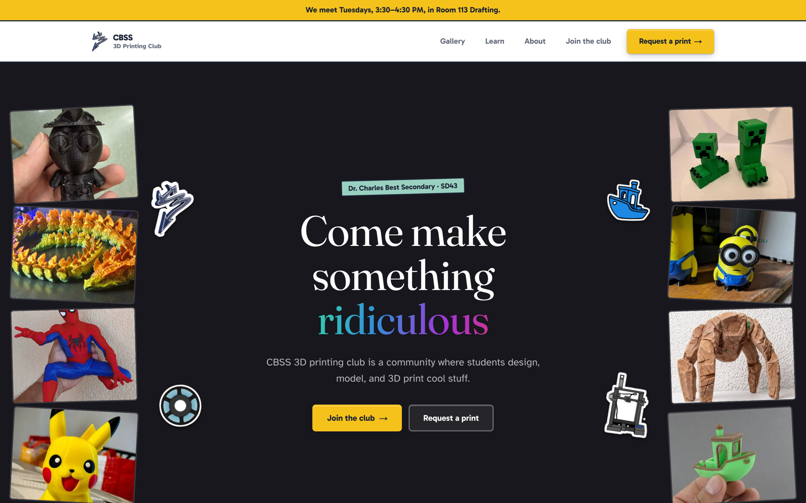
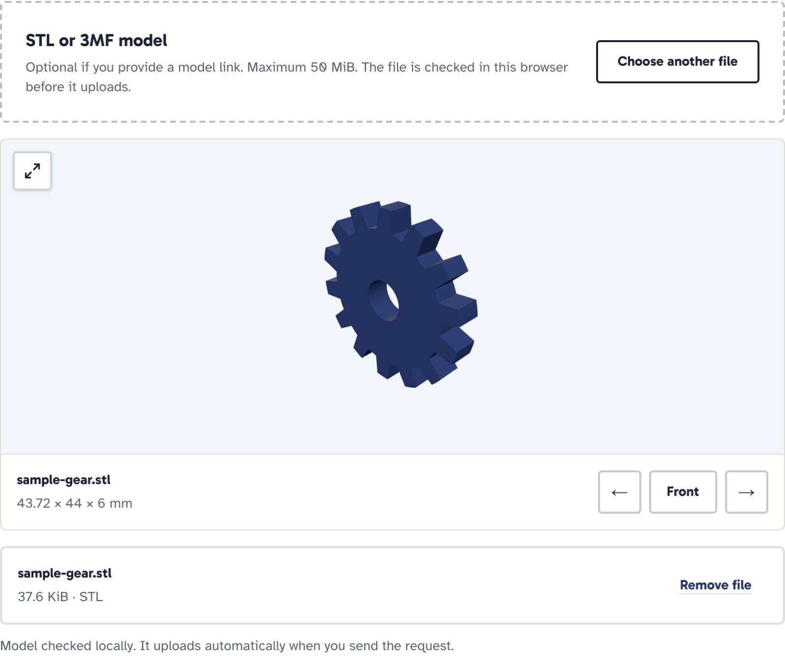
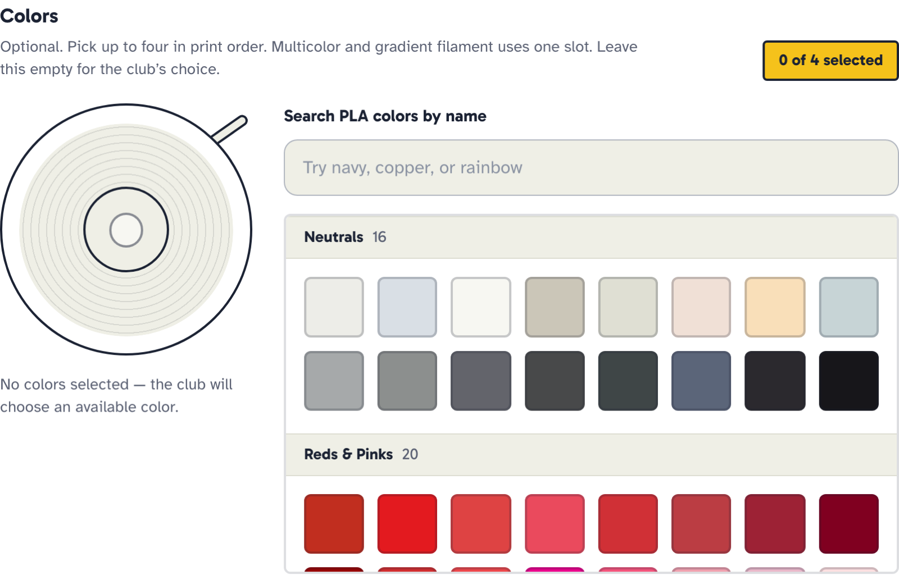
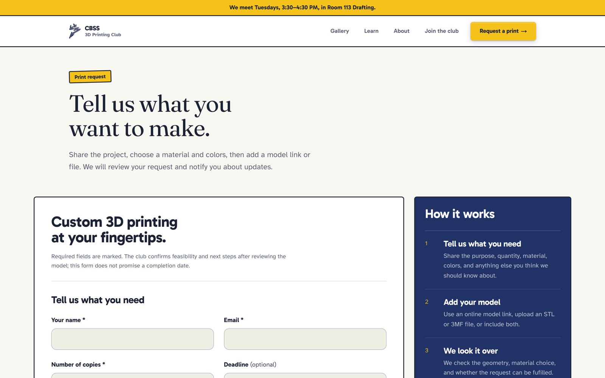
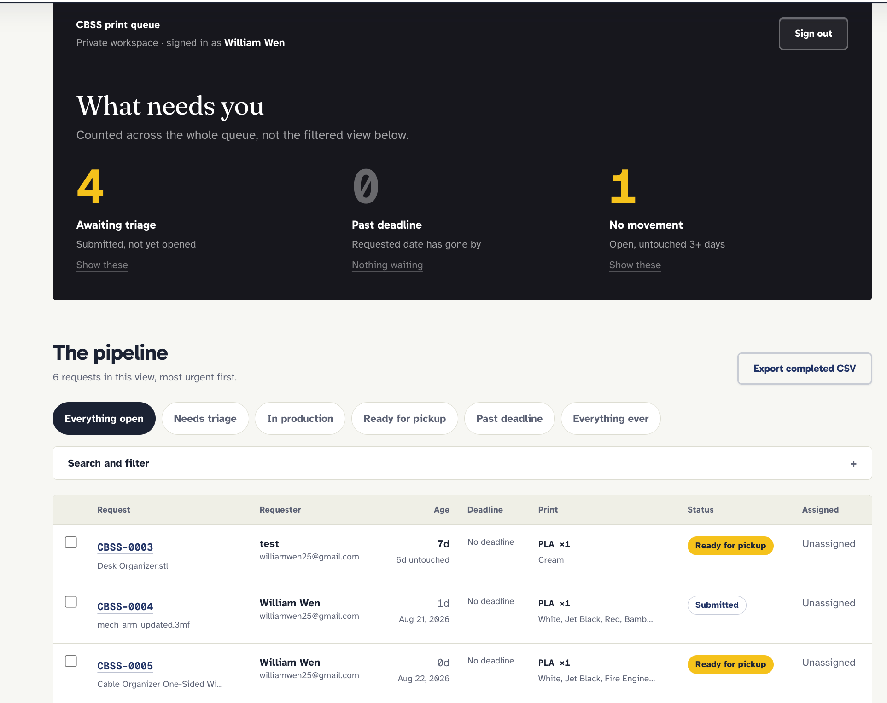
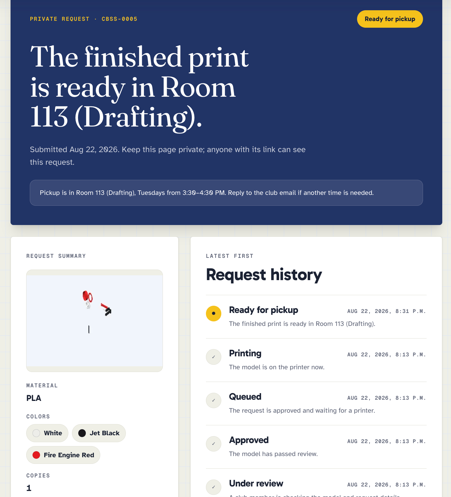
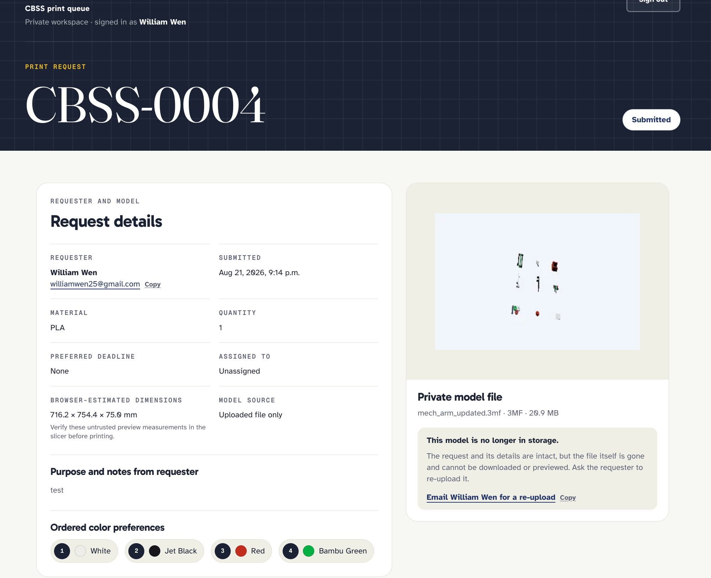

# CBSS 3D Printing Club

The official website and private print-request queue for the 3D Printing Club at Dr.
Charles Best Secondary School.

**https://3dprintingclub.org**

This website is about the 3D printing club at Dr. Charles Best Secondary School. It also features a print queue system that is used mostly by students to request prints, as well as anyone else who wants custom printing to be done by the club for an upcharge. Club Leaders can manage the queue from a private dashboard and can organize all the requests to make sure no print gets forgotten. Request updates sent via email and private status link.

## Screenshots of the website



**Upload a model and see it before you send it.** If you choose to upload a model, a preview will show up where you can select your desired colors (multicolor prints only).



**200+ filament colors to choose from.** Pick up to 4 colors for multicolor printing! Note: we do not have 238 colors but if the user would like a certain color, we will buy that color.








**Requesters (whoever requested the print) can track their print and receive email updates via a link without a login along with additional email updates.**

**Admin status page for individual requests**


## Why did I build this??
After the first year leading my school's (Dr Charles Best Secondary School's) 3D Printing Club, I realized that the club was falling off due to multiple factors, mainly to do with organization, print requests, and management. 3D printing is still relatively niche even in 2026 and most students don't know what it is, which results in less signups/interest compared to similar engineering clubs at my school; as a result, I decided to create this website to make the club more accessible for students who are interested in the club or want to know more about 3D printing at my school. 

People kept asking me "can you print this?" "I saw this cool thing on tiktok! can you make one for me?" "My headphones broke, can you print a new one?" "can you print a phone stand for me?" etc. This was refreshing at first, since it meant that people were interested in 3D printing; however, as time went on, I realized that it was a bit too much to remember so many requests. That's why I integrated the "Print Request System" to the website so students can easily submit their wildest print ideas without asking and other club leaders.

You may be thinking to yourselves: "Why not a spreadsheet rather than a complicated backend?" I thought of that as well, and I came to the conclusion that spreadsheets are versitile for fundraisers and tracking club earnings, but a dedicated print requesting system feels more robust and easier to use for both admins and students.

## The website
When you first load in, you are welcomed to a very personal greeting page, featuring various 3D printed examples and stickers like a collage. There is an alternating adjective which changes every 2 seconds to make the site feel a bit more unique and like it's talking to you. 

Once you scroll down, you find yourselves with all the necessary information about the club, such as student creations, meeting dates, how to join the Teams channel (our school uses Teams), and the print request page.

We also have a header with separate pages for:
- Gallary - A page to showcase various 3D prints and models created by club members.
- Learn - A page to provide educational resources on 3D printing for beginners.
- About - A page to provide general information about the club, along with club contacts.
- Join the Club - A page with information on how to join the club.
- Request a Print - A page to submit print requests (the standing feature of the website).

## The Print Request/Queue system

**For students/requesters**
- Press the "Request a print" button, which brings you to the form.
- Fill in your name, email, quantity, and deadline with notes so club leaders know you are a real person and your intentions.
- Choose your material (PLA, PETG, ASA)
- Choose your filament color(s): if multicolor, choose up to 4 different colors
- Provide a model link OR upload a model directly. (STL/3MF)
- If you upload a model, use the 3D preview to visualize it and apply your chosen colors for multicolor prints to the parts.
- Once you are done the previous steps, hit "send print request" and wait for the print to finish, after pick up from the Drafting Room. 

**For club leaders/admins**
- Sign in with GitHub auth.
- Once in the admin dashboard, you are greeted with the most important information, like what needs your attention, how many prints are past deadline, and how many prints are untouched for 3+ days.
- You can also see the queue from oldest to newest request, all with their dedicated status pages.
- in each request's dedicated status pages, review their print request, accept/decline, and progress to the printing stage.
- Automated email messages will be sent to the requester's email when the status changes or there is a machine anomoly.
- The changes admins make are reflected on the private status pages sent via email.


| Site | What it is? |
| --- | --- |
| `/` `/about` `/gallery` `/guides` | Public club site (general info, resources, join club, etc.) |
| `/request` | The request form |
| `/status/[ref]#token` | Requester status page |
| `/admin` | Queue dashboard|
| `/admin/requests/[id]` | Individual request page for admins. |


## Tech stack

| What | Why? |
| --- | --- |
| Next.js, React, TypeScript | Main web framework, highly customisable and looks good. |
| Tailwind CSS | Styling of the website |
| Neon Postgres + Drizzle ORM | Queue system (backend)|
| Cloudflare R2 | File storage for uploaded models. |
| Auth.js v5, GitHub OAuth | Admin sign-in |
| three.js + saxes | In-browser STL and 3MF preview |
| Resend | Requester and admin emails |
| Cloudflare Turnstile | Bot filtering on the form|

## The Process & Challenges
I first started the website as a simple HTML/CSS site; however, I realized quickly that it would be better to use React/Next.js for the website as I wanted more interactiveness and make the website an impactful impression on anyone who visited it.

The most time consuming and complex part of building this website was definitely the web design for the frontend and the print request system for the backend.

I first vibe-coded a simple design using AI, but the design was far worse than the one I first created manually. Because I don't want my site to look vibe-coded and low effort, I decided to design myself and ended up watching a couple of web design videos and read some articles on web design as well. I then made a mistake of looking at minimalist startup websites for inspiration on the design and I ended up implementing a similar design/vibe on the website. The startup/minimalist design did not fit the vibe I was going for, which is a handmade/personal/cozy vibe. I then had to think of a way to make it feel more personal and add that sense of "elegance". I looked for more inspiration online but all the "club websites" were either static or vibe coded slop. It was then when I realized that the perfect style/design to give me all the vibes I was looking for was right in front of me all along: the Hack Club website. It had all the elements that made the website feel more cozy and personal, yet still professional enough for people to sign up; it was the perfect design to base my website off of. I then spent more hours remaking the design based on the Hack Club website while paying attention to all the small details that makes that website feel "handmade" and truly special. The new design checked all my boxes and turned out to be the design I was looking for this entire time. 

The backend for the print request system was also a challenge. I wanted to create a system that was that was both easy for admins and students to use. The main problem that occured was the file not uploading to cloudflare's storage on the actual website (3dprintingclub.org). This was due to the fact that I forgot to update the domain name which lead to incompatibility and errors in the uploading process, along with the system not being able to recognize slicer exported 3mfs which contains the print settings already. 

## Privacy & Security

The system holds contact details for minors, which must be kept private and secure.

- Private model files: The Cloudflare R2 bucket has no public access. Downloads go
  through signed URLs generated per request.
- Admin access is re-checked on every request/reload
- Upload Verification: A completed upload is checked
  against the object in R2, then copied from a temporary key to an final
  key. Temporary keys expire.
- No payment, donation, or money handling: Students will simply pay in cash/e transfer when needed.
## Running it locally
### start here:

```bash
git clone https://github.com/stickmanned/CBSS-3DPC-Website.git
cd CBSS-3DPC-Website
npm install
cp .env.example .env.local
npm run dev
```

Open http://localhost:3000.

With an empty `.env.local` you get the homepage, about, gallery, guides, and the
full request form including the 3D model preview.

What will not work initially:

| problem | needs |
| --- | --- |
| Actually submitting a request | `DATABASE_URL` and an R2 bucket |
| Admin sign-in at `/admin` | A GitHub OAuth app |
| Status pages | `DATABASE_URL` |
| Emails | A Resend key and a verified domain |


### Full setup

All five providers have free tiers. Takes some time to set up.

1. **Neon Postgres.** Create a database, set `DATABASE_URL` with `sslmode=require`, then run
   `npm run db:migrate`.
2. **Cloudflare R2.** Create a private bucket and an API token scoped to
   only that bucket. Give the app object list and delete access, and
   add a one-day lifecycle rule on the `uploads/temp/` prefix.
3. **GitHub OAuth app.**
   Callback URLs:
   - Local: `http://localhost:3000/api/auth/callback/github`
   - Production: `https://YOUR-DOMAIN/api/auth/callback/github`

   Then set yourself as an admin using your numeric GitHub account ID:

   ```bash
   npm run seed:admin -- --github-id 12345678 --login your-login --name "Your Name"
   ```
4. **Resend.** Verify a sending domain with SPF and DKIM
    , set the sender, reply-to, and notification
   addresses.
5. **Cloudflare Turnstile.**
   Set both keys and list
   every hostname the form is served from.

Every variable is documented in .env.example. Fill it
before migrating, and never commit `.env.local` unless you want your private data to be leaked!

## AI disclosure
AI was used as a tool in this project rather than a replacement for everything. I used AI mainly to help with the interactive animations on the website and the backend logic for the print request system. AI was also a big help in debugging and testing as I used it to help me with errors I encountered and help me test if everything was working as intended so the site is ready for shipping.

## Credits
Thanks to Hack Club for the amazing website that inspired this design.
Special thanks to Mr. Anania, our amazing club sponsor teacher. Without you, this club would not exist.
Huge thanks to co leader Paya Maroufi for helping out with club affairs and testing the website.
## License
MIT License
